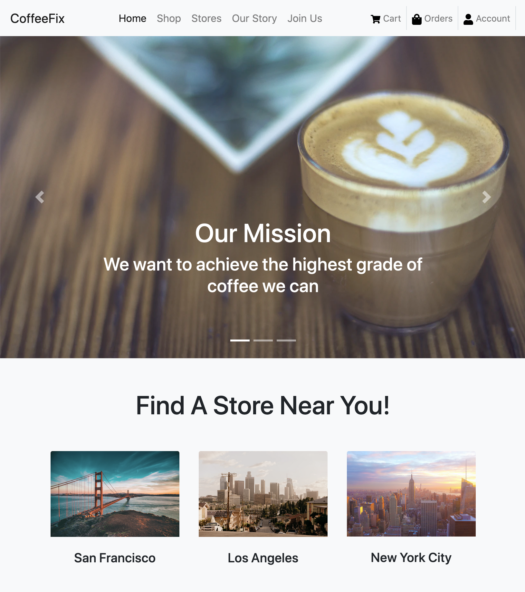
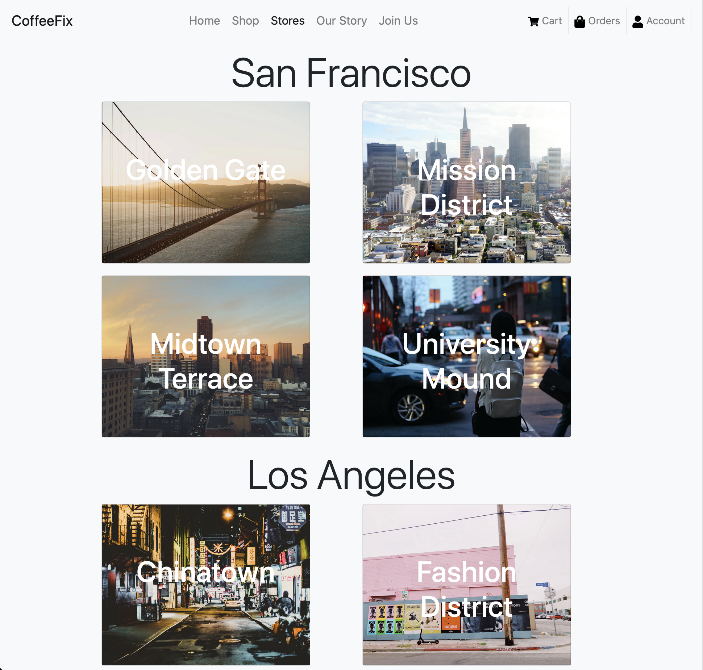
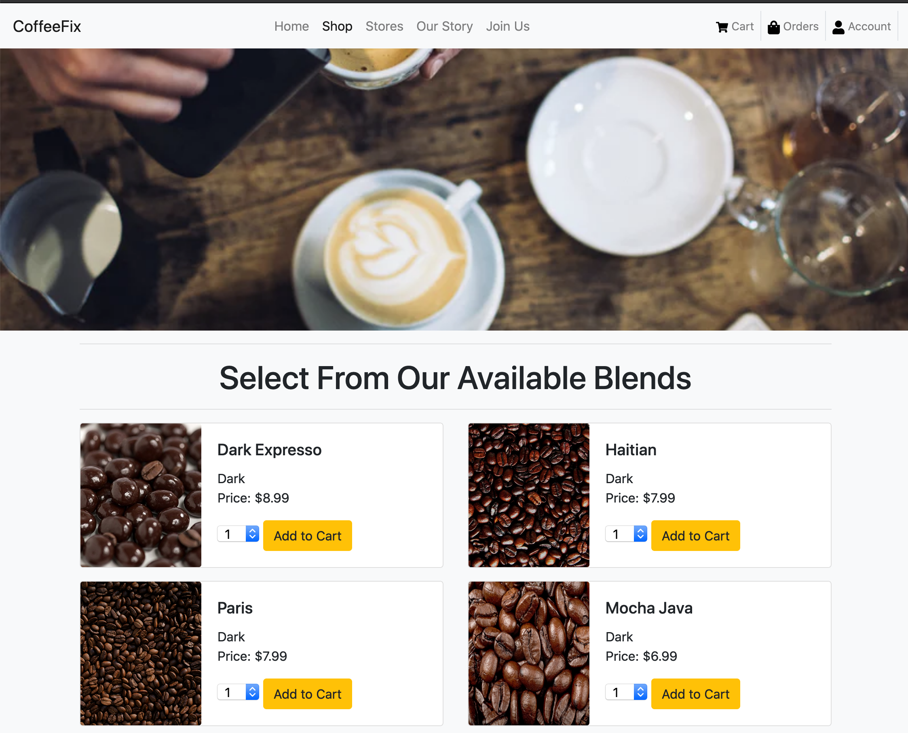

# Coffee-Shop-Website
This project implements a coffee shop website. Users can log in, sign up and order items from the shop. Popular drinks are displayed on the homepage.

## Built With
* CSS, HTML, JavaScript, Bootstrap 4
* Node, Express, MongoDB, Mongoose

## Screenshots
<div>
  
  
  
  
</div>

## How to modify:
In the constants.js file, add links to the images.

## How to execute:
1. Start mongo server
```
sudo service mongod start
```
2. Open up a mongo shell to view database
3. Use Coffee Shop database
```
mongo
use Coffee_Shop
```
6. Add all npm dependencies
```
npm install
```
7. While database server is running and in project directory execute the following:
```
node app.js
```
